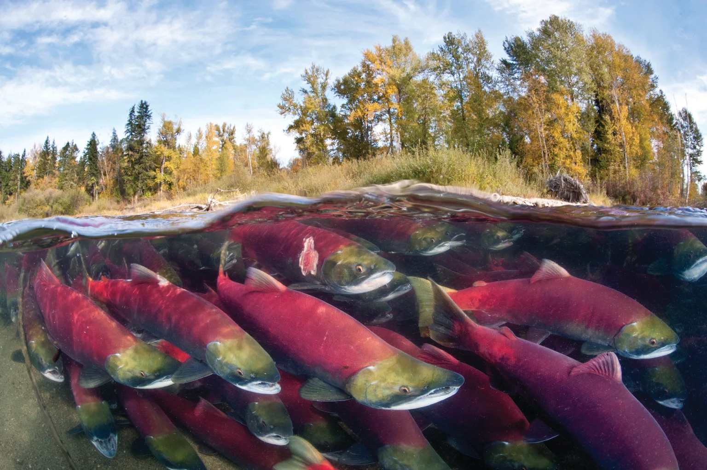
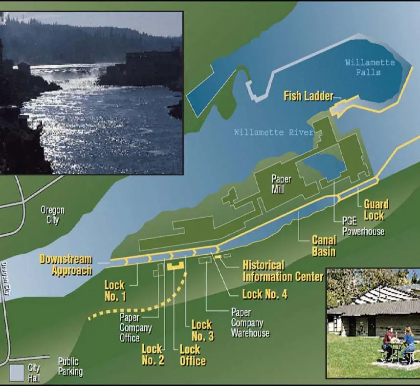

```{r setup, include=TRUE, warning = FALSE, message = FALSE}
knitr::opts_chunk$set(echo = TRUE, warning = FALSE, message = FALSE)
library(tidyverse)
library(here)
library(lubridate)
library(feasts)
```
## Overview {.tabset}

This project explores data recorded by the Willamette Falls Fish Ladder from 2001 to 2010. We explored adult fish passage through the fish ladder for three salmon species: coho, jack coho, and steelhead.

This report includes:

- An original times series for adult passage for coho, jack coho, and steelhead salmon. 
- Seasonplots of each species.
- Annual counts of each species, by year. 








Citation: Columbia River DART (Data Access in Real Time), 2010. Data Courtesy of U.S. Army Corps of Engineers, NWD and Chelan, Douglas, and Grant County PUDs, Yakima Klickitat Fisheries Project, Colville Tribes Fish & Wildlife (OBMEP), Oregon Department of Fish & Wildlife, Washington Department of Fish & Wildlife. http://www.cbr.washington.edu/dart/query/adult_graph_text


### Original Time Series 
```{r}
# read in the data and usual clean up 
fish <- read_csv(here("data","willamette_fish_passage.csv")) %>% 
  janitor::clean_names() %>% 
  select(date, steelhead, coho, jack_coho) %>% #selecting for the fish of interest 
  replace(is.na(.),0)   #replacing nas with 0 
 

  
#Now I need to covert the df to tsibble (a times series df )
fish_ts <- fish %>% 
  mutate(date = lubridate::mdy(date)) %>%  #making my date column class: date 
  as_tsibble(key = NULL, index = date)

# pivot data so species is in same column 
fish_ts_pivot <- fish_ts %>% 
  pivot_longer(cols = 2:4, names_to = "species", values_to = "count")


## Making a vector for easy facet wrap plot labels
species_vect <- c("Coho", "Jack Coho", "Steelhead")
names(species_vect) <- c("coho", "jack_coho", "steelhead")


## Now i can visualize the data 
ggplot(data = fish_ts_pivot, aes(x = date, y = count, color = species)) +
  geom_line() + 
  facet_wrap(~species, nrow = 3,
             strip.position = 'right',
             labeller = labeller(species = species_vect)) + 
  ## customize axis with cont 'date' class data (Thank you to Nick for showing me this)
  scale_x_date(limits = as.Date(c('2001-01-01', '2010-12-31')),
               date_breaks = "1 year",
               date_labels = "%Y") +
  scale_color_manual(values = c("#ff9ea2", "#dbb6d6", "#4c8481")) +
  theme_minimal() +
  theme(panel.grid.minor.y = element_blank(),
    strip.text = element_text(face = 'bold'),
    strip.background = element_rect(fill = "#dbb6d6"),
    legend.position = "none")

```
**Figure 1.** Time series of Coho, Jack Coho, and Steelhead counts on the Willamette fish ladder between 2001 and 2010.

Notable Trends: 

- Steelhead seems to have the widest seasonality and access the fish ladder more than the other two species. 
- Coho accessing the ladder seem to be increasing from 2001 to 2005. 


### Seasonplots
(content)
```{r}
# make the seasonplot with gg_season()


fish_ts_pivot  %>% 
  gg_season(y = count,
            pal = c('#ff9ea2', '#dbb6d6', '#4c8481', '#3b444f')) +
  facet_wrap(~species, nrow = 3, strip.position = 'right',
             labeller = labeller(species = species_vect)) +
  labs(x = element_blank(),
       y = 'Daily fish count') +
  scale_x_date(date_breaks = "1 month",
               date_labels = "%b") +
  theme_bw() +
    theme(
    axis.title = element_text(face = 'bold'),
    panel.grid.minor.y = element_blank(),
    strip.text = element_text(face = 'bold'),
    strip.background = element_rect(fill = '#dbb6d6'),
    legend.background = element_blank(),
    legend.text = element_text(size = 9),
    legend.position = c(0.08, 0.85),
    legend.key.size = unit(0.9, 'line')
  )

```

**Figure 2.** Seasonplots of Coho, Jack Coho, and Steelhead accessing the Willamette Fish Ladder. Line color indicates year. 

Notable Trends: 

- Coho and Coho Jack utilize the fish ladder from September to November. 
- Coho has higher daily fish counts in 2010 that recent years. 
- Steelhead utilize the fish ladder much more frequently than Coho and Jack Coho. Peak activity ranges from February through July. 


### Annual counts by species
```{r}
## create a new df that holds annual total by species 
fish_count_yr <- as.data.frame(fish_ts_pivot) %>% 
  mutate(year = lubridate::year(date)) %>% 
  select(-date) %>% 
  group_by(year, species) %>% 
  summarize(year_count = sum(count))

## vizualize annual counts of 3 species 
ggplot(data = fish_count_yr, aes(x = year, y = year_count)) +
  geom_col(aes(fill = species),
           color = "#3b444f") +
  scale_fill_manual(values = c("#ff9ea2", "#dbb6d6", "#4c8481" ),
                   labels = c("Coho", "Jack Coho", "Steelhead")) +
scale_x_continuous(breaks = seq(from = 2001, to = 2010, by = 1),
                     expand = c(0,0)) +
  scale_y_continuous(expand = c(0,0)) +
  labs(x = element_blank(),
       y = "Annual Counts") +
  theme_minimal() +
  theme(
    legend.title = element_blank()
  )
  
```

**Figure 3.** Annual counts of salmon by species, from 2001 to 2010. 

Notable Trends: 

- Coho counts have increased from 2001 to 2010. 
- Jack Coho counts have been highly variable over the years, with no clear pattern. They are much less common than the Coho and Steelhead. 
- Steelhead does not have a clear trend. 2002 was the best year for the Steelhead, but 2010 did well in comparison to a slight dip in count from 2007 to 2009. Steelhead are the most abundant species we see at this fish ladder. 
